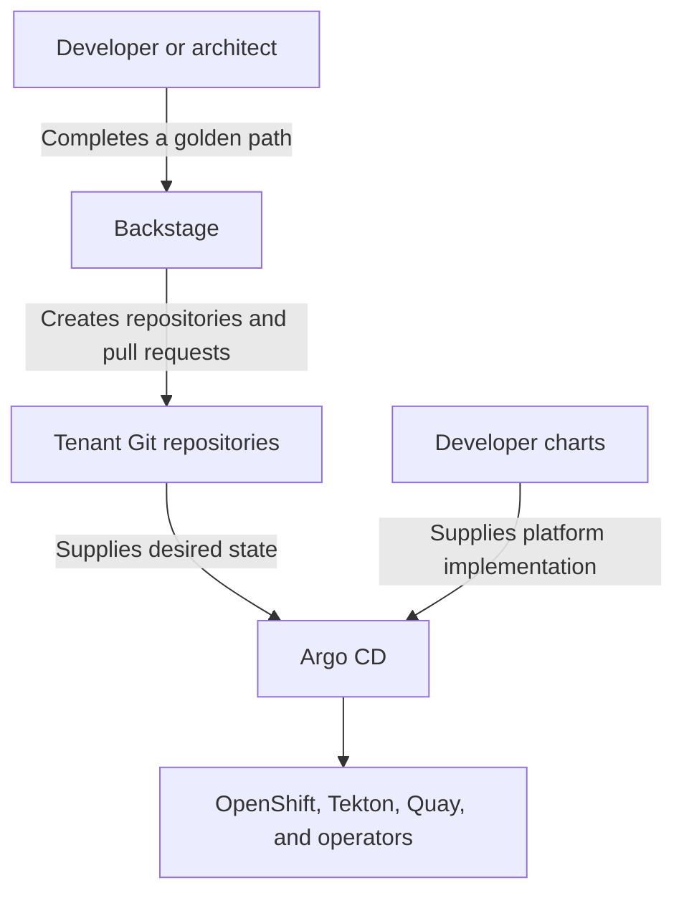

# Contract-First IDP Software Templates

Give developers clear Backstage golden paths from an idea to reviewable, deployable Git state.

These templates turn short forms into catalog entities, source repositories, GitOps configuration,
and pull requests. Developers get a useful starting point; platform teams keep control of the
runtime implementation; Git keeps the handoff visible to everyone.

## Start here

- **Setting up a tenant:** follow [Bootstrap a tenant](docs/getting-started.md), then use the
  [golden paths](#choose-a-golden-path) in order.
- **Learning the model:** read [Architecture and Git contracts](docs/architecture.md).
- **Contributing a template:** start with [Development and testing](docs/development.md).

If you are installing the platform itself, begin in `platform-components`. Most developers use
these templates through Developer Hub and do not need to clone this repository.

## Choose a golden path

For a new tenant, follow the first five paths in order. Use the lifecycle paths whenever the
application moves forward.

| Order | Golden path | What it does | What you get |
| ---: | --- | --- | --- |
| 1 | **Create Tenant Domain** | Defines the tenant, owners, environments, and platform target | A Domain repository and a platform-admission pull request |
| 2 | **System Golden Path** | Groups related APIs, Components, and Resources | A System repository active in the build environment |
| 3 | **OpenAPI Specification Golden Path** | Creates and governs an API contract independently | An API repository and Registry publication configuration |
| 4 | **Component Golden Path** | Creates a Java API producer or consumer | Source, developer tooling, catalog metadata, and build GitOps state |
| 5 | **Resource Golden Path** | Requests a supported managed dependency | A Resource repository and environment configuration |
| Repeat | **Activate System Environment** | Activates a System in its next environment | A Domain repository pull request |
| Repeat | **Promote Component** | Selects a release for the next environment | A System repository pull request |

The model has one simple hierarchy: a Domain owns Systems; a System owns APIs, Components, and
Resources. API and Component lifecycles remain independent, so a team can design a contract before,
during, or after implementing it.

## What happens after a form is submitted



The flow is intentionally one-way. Backstage writes to Git, Argo CD reads from Git, and the charts
reconcile the cluster. Backstage never needs Kubernetes credentials, and the charts never write
back to tenant repositories.

## Supported coordinated release

```text
platform-components: v1.0.0
software-templates:  v1.0.0
developer-charts:    v1.0.0
contract generation: v1
```

The templates create intent; they do not install operators, deploy workloads, create SCM
organizations, or bypass Git review. Runtime behavior belongs to `developer-charts`, while platform
installation belongs to `platform-components`.

## Documentation

### Tenant setup

Follow [Bootstrap a tenant](docs/getting-started.md). It covers the required GitHub organization and
teams, the first Backstage form, cluster attachment, and the recommended creation order.

### Architecture and delivery

Read [Architecture and Git contracts](docs/architecture.md) for:

- the Backstage entity model;
- repository ownership and platform/tenant SCM separation;
- the files that activate Systems, releases, and Resources;
- API publication, Component builds, releases, promotion, and rollback.

### Template development

Read [Development and testing](docs/development.md). The default suite is local and deterministic:

```bash
make test
```

All Node and Jest tooling is scoped under `test/`; this repository is not an npm package. The
direct equivalent is `npm ci --prefix test` followed by `npm test --prefix test`.

## Why the generated repositories are separate

The golden paths create several repositories because they represent different ownership and
change patterns—not merely different directories.

| Repository class | Why it exists separately | Contains | Owned by |
| --- | --- | --- | --- |
| Domain | Gives the tenant one authoritative portable lifecycle | Catalog entity, target reference, environment policy, and System activations | Domain maintainers |
| System | Protects shared application desired state from routine source changes | Catalog entity and desired state for APIs, Components, releases, and Resources | Domain maintainers |
| API | Lets a contract be designed, released, and consumed independently of any implementation | One self-contained OpenAPI contract and its Maven publication project | Maintainers and contributors |
| Component | Gives an implementation its own build history, dependencies, and developer workflow | Source, API selections, Devfile, and Maven wrapper | Maintainers and contributors |
| Resource | Provides a stable catalog and documentation identity even when its platform implementation changes | Resource entity and implementation-facing documentation | Maintainers and contributors |

Child golden paths derive ownership and repository location from the parent Domain. They do not ask
for an independent owner or SCM destination. That constraint prevents child entities from silently
escaping the tenant's ownership and SCM scope.

## Repository map

| Path | Purpose |
| --- | --- |
| [`catalog-info.yaml`](catalog-info.yaml) | Root Backstage Location that registers the active templates |
| [`templates/`](templates/) | Backstage template definitions |
| [`skeletons/`](skeletons/) | Generated repository and pull-request content |
| [`test/fixtures/`](test/fixtures/) | Input sets and multi-entity scenarios used only by tests |
| [`test/contracts/`](test/contracts/) | Repository and template-to-chart contract tests |
| [`test/coordinated/`](test/coordinated/) | Manual current-source contracts across sibling repositories |
| [`test/release/`](test/release/) | Manual validation of released dependency revisions |
| [`test/skeletons/`](test/skeletons/) | Deterministic generated-source tests |
| [`test/helpers/`](test/helpers/) | Shared test fixtures, renderers, assertions, and path helpers |
| [`test/build/`](test/build/) | Explicit Maven baseline verification |
| [`test/smoke/`](test/smoke/) | Opt-in live Backstage dry-run tests |
| [`test/live/`](test/live/) | Opt-in external-service checks |

Secondary lifecycle templates live beside the entity-creation template:
[`templates/system/activation.yaml`](templates/system/activation.yaml) activates a System
environment, and [`templates/component/promotion.yaml`](templates/component/promotion.yaml)
promotes a release.

## Backstage integration

Developer Hub's GitHub provider discovers `/catalog-info.yaml` across its configured organization,
including this repository's Location. Each Domain, System, API, Component, and Resource golden path
also immediately registers the generated repository-root `catalog-info.yaml` after publication.
Provider discovery supplies broad discovery and recovery; Scaffolder registration supplies prompt
task feedback and works when the generated repository is outside the provider organization.

Test data lives only under `test/fixtures/` and is never registered by the production catalog.
Generated GitOps entrypoints use the released chart structure explicitly:
`domain/environment`, `system/environment`, `api/openapi`, `component/openjdk`, and
`resource/postgresql` under `charts/`.

The following action IDs must be available to the Backstage scaffolder:

| Capability | Action IDs |
| --- | --- |
| Read catalog and files | `catalog:fetch`, `fetch:plain:file` |
| Render content | `fetch:template` |
| Parse, transform, and write contracts | `roadiehq:utils:fs:parse`, `roadiehq:utils:fs:write`, `roadiehq:utils:jsonata`, `roadiehq:utils:serialize:yaml` |
| Publish repositories and pull requests | `publish:github`, `publish:github:pull-request` |
| Register entities | `catalog:register` |
| Configure webhooks | `github:webhook` |
| Troubleshoot template execution | `debug:log` |

GitHub is the primary SCM: configure Backstage's GitHub integration for repository publication,
pull requests, team access, webhooks, and root catalog discovery. Register a typed platform target
Resource before running
the Domain golden path. No project-specific scaffolder action is required. Install
`@backstage/plugin-scaffolder-backend-module-github` and
`@roadiehq/scaffolder-backend-module-utils`, along with the Backstage catalog and fetch action
modules that provide the IDs above.

The RHDH 1.10 platform distribution explicitly installs the compatible Roadie dynamic plugin
overlay `roadiehq-scaffolder-backend-module-utils:bs_1.49.4__4.1.2`. In Developer Hub, verify the
four `roadiehq:utils:*` IDs above in the installed scaffolder actions before running a template.
The Domain, API, and Component templates consume `spec.platform` directly from the selected target
entity. Component contract discovery uses Apicurio downloads and narrowly scoped Roadie parsing;
the target itself requires no secondary fetch or parse.

> **Gitea compatibility:** A Gitea compatibility plugin can expose the GitHub-compatible actions
> used by these templates. The checked-in lab configuration uses that integration; GitHub users do
> not need it.

The deterministic suite and all fixtures use the singular `test/` directory:

```bash
make test
```

## Current limitations

- All generated tenant repositories are public by default, and default-branch protection is
  disabled. API and Component source must remain readable anonymously for the current Tekton clone
  path.
- Multi-cluster environment placement is reserved but not implemented; every environment currently
  uses the Domain's selected target.
- Webhook signature verification is reserved but not implemented for the lab EventListeners.
- Component release materialization does not prevent an existing human image tag from being moved;
  enforce tag immutability in Quay or through release policy.
- PostgreSQL is the only included Resource implementation profile.
- Bookinfo and cross-System samples are test fixtures, not production catalog requirements.

These are deliberate current constraints, not hidden prerequisites. See
[Architecture and Git contracts](docs/architecture.md#security-and-trust-model) for their
operational impact.
