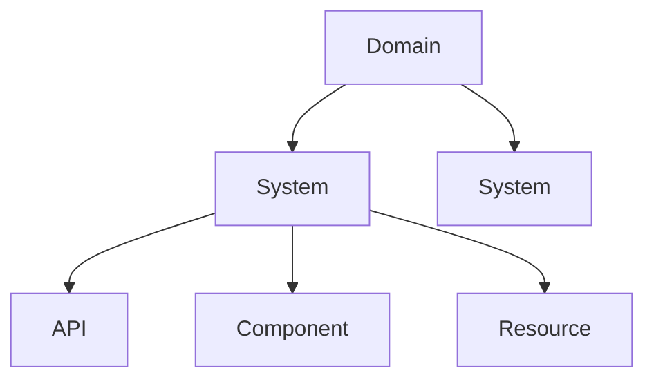
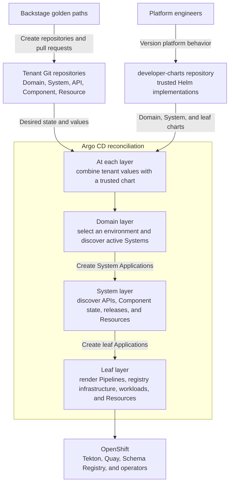
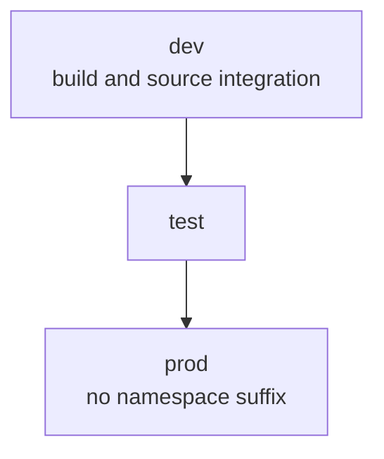
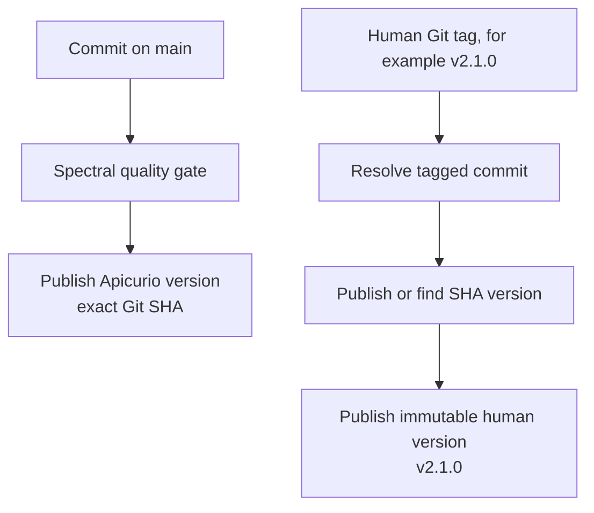
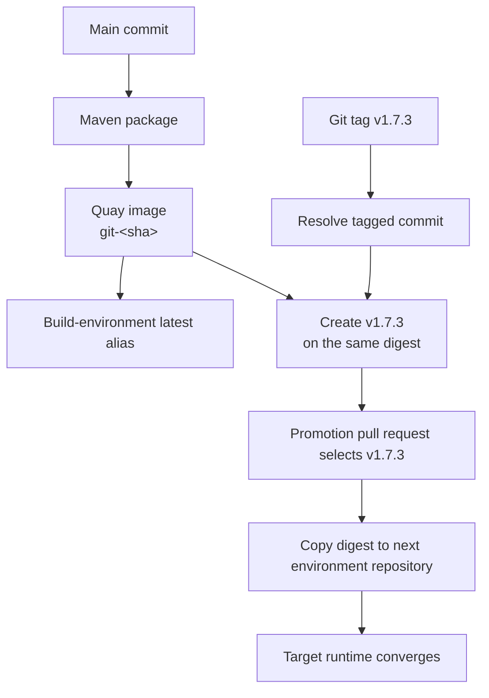

# Architecture and Git contracts

Contract-First IDP separates developer intent from platform implementation. This document explains
the responsibilities of Backstage, tenant repositories, Argo CD, and the runtime platform.

## Why intent and implementation are separate

The central design problem is how to give developers a short, safe path to production without
making Backstage the owner of production or exposing every infrastructure decision in a form.

`software-templates` owns the language of developer intent: catalog relationships, contracts,
repository structure, environment configuration, and release selections. `developer-charts` owns
the trusted interpretation of that intent on the cluster. Tenant Git is the stable interface
between them.

This split provides:

- **auditability:** creation, activation, promotion, and rollback become ordinary Git history;
- **least privilege:** Backstage writes Git but does not require Kubernetes credentials;
- **independent evolution:** developer experience and platform implementation can change on
  different schedules as long as their tested Git contract remains compatible;
- **recoverability:** reconciliation can retry from Git after Backstage has finished;
- **portability of intent:** tenant repositories describe what is wanted without embedding
  operator credentials or an arbitrary implementation repository.

Reconciliation is intentionally asynchronous. A successful Backstage task means the requested Git
change was created; Argo CD, Tekton, Registry, and image transport converge afterward. The
documentation and UI must make that transition visible.

## Design rationale

| Decision | Rationale |
| --- | --- |
| Use Git as the handoff | Backstage should capture intent and finish after creating a reviewable SCM change, not remain connected while several platform controllers complete their work. Git outlives the scaffolder task, provides audit and approval history, and lets reconciliation resume after transient failures. Backstage completion therefore confirms the Git change, not runtime readiness. |
| Keep API contracts independent | A contract is a product shared by providers and consumers, not an implementation detail of either side. Giving it a repository and release history allows parallel development, independent compatibility review, and explicit floating or immutable version selection. Backstage relationships remain unversioned, while `api-dependencies.yaml` records the versions a Component actually selected. |
| Derive child ownership and SCM identity from the Domain | The Domain already establishes the organization, repository host, teams, and lifecycle for the tenant. Reusing that information removes repetitive form choices and prevents a child entity from acquiring contradictory ownership or publishing outside the tenant's SCM scope. Moving an entity elsewhere is treated as an administrative migration rather than an ordinary golden-path option. |
| Encode lifecycle changes as small file-presence signals | System activation, Component release, and Resource provisioning are easier to review when each is represented by a narrow file whose presence has one defined meaning. ApplicationSets can discover those files directly without maintaining a generated central manifest. Because absence is also meaningful, the paths are treated as a versioned contract and covered by deterministic tests. |
| Keep release overlays artifact-only | A release file answers one question: which versioned artifact should run in this environment. Runtime configuration remains in common and environment values, so promotion cannot unexpectedly alter replicas, Routes, health checks, or Secret references. Rollback selects an older release without reverting unrelated configuration. |
| Compose existing Backstage action modules | GitHub actions handle repository operations, while RoadieHQ utility actions perform declarative contract transformations. This keeps the golden paths on maintained integrations and avoids project-specific action code with its own security and upgrade lifecycle. Organization administration and Git tag creation stay outside the templates because they require different privileges and are not safely covered by the available action set. |
| Keep Backstage out of the cluster | Repository credentials are sufficient for scaffolding and pull requests; giving the same process Kubernetes credentials would increase privilege and encourage imperative deployment steps. A platform administrator admits Domain entrypoints through cluster GitOps, after which Argo CD owns reconciliation. |
| Clone public tenant source anonymously for now | Anonymous clone keeps the current build path simple and avoids distributing source credentials into every tenant namespace. This is a tactical operating model rather than a general security claim: supporting private source requires an explicit credential-distribution and rotation design. |

## Catalog model



A Domain is the tenant and lifecycle authority. Systems group application capabilities inside that
Domain. APIs define communication contracts independently; Components implement or consume them;
Resources represent managed dependencies. Catalog relationships are intentionally unversioned,
while generated `api-dependencies.yaml` records a Component's reviewable contract versions.

Every entity-producing repository stores its primary descriptor at `/catalog-info.yaml`. Golden
paths immediately register that file, while the organization-wide GitHub provider independently
discovers the same root convention for broad discovery and recovery.

The API, Component, and Resource nodes are peers under a System. Their provider and consumer
relationships are catalog metadata, not another containment level.

## Sources of truth

| Concern | Source of truth | Who changes it |
| --- | --- | --- |
| Catalog topology and ownership | Generated `catalog-info.yaml` files | Backstage golden paths and repository owners |
| Domain environment order | Domain entity | Domain maintainers |
| System activation | Domain repository | System creation or activation pull request |
| API, Component, release, and Resource intent | System repository | Entity creation or promotion pull request |
| API contract | API repository `specification.yaml` | API owners |
| Component implementation | Component repository | Component owners |
| Platform implementation | `developer-charts` | Platform engineers |
| Runtime resources | Argo CD-rendered desired state | Controllers; never edited directly |

## Reconciliation



The two inputs have different owners and purposes. Tenant Git selects desired state; the
`developer-charts` repository supplies trusted implementations and infrastructure integration.
Argo CD combines them without copying either source into the other.

Each layer creates Argo CD Applications for the next layer. The charts do not invoke one another
directly:

| Reconciliation layer | Reads | Produces |
| --- | --- | --- |
| Domain | Domain lifecycle, selected environment, System activation files, and the Domain chart | One System Application for each active System |
| System | System desired-state files, environment policy, and the System chart | Independent API, Component environment, Component runtime, and Resource Applications |
| Leaf | Entity-specific values and the corresponding trusted chart | Tekton, registry, workload, and managed-Resource objects on OpenShift |

No chart writes back to Git.

## Git discovery contracts

File presence is a deliberate API between the templates and charts.

### Domain repository

| Path | Meaning when present | Meaning when absent |
| --- | --- | --- |
| `systems/<system>/environments/<environment>.yaml` | Activate the System in that Domain environment | The System is not attached there |

### System repository

| Path | Responsibility |
| --- | --- |
| `apis/<api>/values.yaml` | Configure validation and Schema Registry publication |
| `components/<component>/values.yaml` | Hold team-owned values shared across environments |
| `components/<component>/environments/<environment>.yaml` | Create environment-local registry infrastructure and runtime configuration |
| `components/<component>/releases/<environment>.yaml` | Select one versioned runtime artifact |
| `resources/<profile>/<resource>/values.yaml` | Hold common Resource intent |
| `resources/<profile>/<resource>/environments/<environment>.yaml` | Provision the Resource in that environment |

A Component release file contains only the artifact selection:

```yaml
image:
  tag: v1.7.3
```

Promotion never rewrites replicas, Routes, resource requests, health checks, or Secret references.
Rollback selects an older release tag through the same reviewable mechanism.

## Environment lifecycle

The Domain declares a build environment and an ordered lifecycle. Promotion always moves between
adjacent environments.



Environment names are configuration, not hard-coded platform concepts. The first ordered
environment must be the build environment. System activation and Component promotion reject
undeclared and build-environment targets, but the forms do not currently enforce uniqueness or
adjacent selection. Reviewers must preserve the declared order. The golden-path default is `dev`,
`test`, `prod`, with `dev` as build and an empty namespace suffix for `prod`.

## API lifecycle

Git remains the authoritative API contract source. The API golden path accepts a self-contained
OpenAPI YAML or JSON document or creates a minimal OpenAPI 3.1 scaffold. It preserves uploaded
contract content without attempting contract governance in Backstage. Spectral owns validation in
the API publication Pipeline.



An Argo CD Sync hook publishes the initial revision. Webhooks invoke the same Tekton Pipeline for
later pushes and release tags. `info.version` is contract metadata; Git tags declare releases.

Generated Components retrieve contracts with the official Apicurio Maven plugin:

| Selection | Scaffolding source | Build behavior | Reproducibility |
| --- | --- | --- | --- |
| `latest` | Apicurio `branch=latest` content | Follows the latest available publication | Floating |
| Human release, such as `v2.1.0` | Exact Apicurio version | Downloads that immutable Registry version | Repeatable |
| Exact 40-character Git SHA | Exact Apicurio version | Downloads that immutable Registry version | Repeatable |

Each selected API gets its own namespace-qualified local contract filename and
`openapi.client.<alias>.host` property. Camel profiles generate dormant, API-qualified `direct:`
routes when operation IDs are available; contracts without operation IDs still receive download,
host, catalog, and developer-documentation wiring.

## Component build, release, and promotion

The default and recommended implementation is **Quarkus Camel OpenAPI with Java DSL**. The
Component form presents the profiles in this order:

| Priority | Implementation profile | Intended use |
| ---: | --- | --- |
| 1 | Quarkus Camel OpenAPI — Java DSL | Recommended default for Camel-based API implementations |
| 2 | Quarkus Camel OpenAPI — YAML DSL | Quarkus when declarative routes are preferred |
| 3 | Spring Boot Camel OpenAPI — Java DSL | Spring Boot applications that require Camel |
| 4 | Spring Boot OpenAPI | Spring Boot applications without Camel route scaffolding |

All profiles target Java 21 and include a Maven wrapper. Main commits are built once; releases and
promotions move immutable digests rather than rebuilding source.



A human Component tag can be created with:

```bash
git tag -a v1.7.3 <commit> -m "Release v1.7.3"
git push origin v1.7.3
```

Release materialization is asynchronous and does not alter System desired state. Promotion is a
separate pull request. The current build-environment release task copies the commit image to the
human tag without checking whether that tag already exists, so Quay or release policy must prevent
tag movement. A target Deployment may briefly report `ImagePullBackOff` while the promotion
Pipeline copies the image; Kubernetes retries until the digest-checked target-local tag is
available.

## Repository ownership and SCM separation

| Repository class | Maintainers | Contributors | Viewers |
| --- | ---: | ---: | ---: |
| Domain and System GitOps | Write | No access by default | Read |
| API, Component, and Resource | Write | Write | Read |

Generated entities use canonical annotations:

```yaml
metadata:
  annotations:
    contract-first-idp.github.io/scm-provider: github
    contract-first-idp.github.io/scm-host: github.com
    contract-first-idp.github.io/domain-org: tenant-org
    contract-first-idp.github.io/domain-repo: tenant-domain
    contract-first-idp.github.io/repository-name: repository-name
```

The provider, host, organization, and Domain repository annotations identify the tenant SCM
context. Child entities store only their repository-name segment; templates assemble clone URLs
and provider-specific action inputs only when needed.

Platform and tenant repositories can use separate hosts and visibility:

| Repository group | Typical repositories | Access model |
| --- | --- | --- |
| Platform | `software-templates`, `developer-charts` | Public or private; platform services need read access |
| Tenant GitOps | `<domain>-domain`, `<system>-system` | Generated public with team write access |
| Tenant source | API, Component, and Resource repositories | Generated public; Tekton clones anonymously |

Domain annotations locate tenant repositories. `spec.platformTarget` selects a catalog Resource;
the target supplies the platform repository, chart, router, and Schema Registry coordinates.

## Security and trust model

- **Public repository defaults:** All generated tenant repositories are public and their default
  branches are unprotected. Team grants establish write responsibility but do not restrict read
  access. Tekton receives no tenant Git credential, so private API and Component source requires a
  credential-distribution design.
- **Reviewed cluster admission:** Backstage does not receive cluster credentials. It opens an
  append-only platform pull request and Argo CD reconciles it after review and merge.
- **Unsigned lab webhooks:** EventListener signature verification is not yet implemented. Treat
  public webhook Routes as development or lab integrations.
- **Promotion safeguards:** Cross-environment promotion refuses a target tag that already points to
  another digest. Build-environment release materialization does not perform the same preflight
  check, so human tags require external immutability policy.
- **Platform-controlled implementations:** Resource declarations select a supported profile and
  chart path but cannot redirect Argo CD to an arbitrary repository or revision.
- **Permissive AppProjects:** Generated projects currently organize ownership. Authorization
  hardening remains separate platform work.

## Related documentation

- [Bootstrap a tenant](getting-started.md)
- [Development and testing](development.md)
- In the companion `developer-charts` repository: `docs/architecture.md` and
  `docs/platform-requirements.md`
